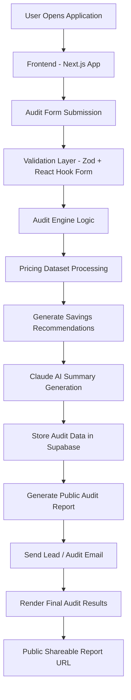

# LLM Audit — System Architecture

## Overview

LLM Audit is an AI-powered SaaS platform that analyzes a company’s AI tooling expenses and generates optimization recommendations to reduce unnecessary spending. The system combines a modern frontend, audit engine logic, AI-generated summaries, and cloud-hosted backend infrastructure to deliver personalized audit reports.

---

# System Architecture Diagram

---

# Data Flow

## 1. User Input

The user enters:
- Team size
- AI tools currently being used
- Monthly spending
- Usage category and workflow information

This data is collected through the frontend audit form built using React Hook Form and validated using Zod schemas.

---

## 2. Validation & Processing

Once submitted:
- Form data is validated
- Numeric values are sanitized
- Audit input is transformed into a structured format

The audit engine then:
- Matches tools against pricing datasets
- Calculates estimated savings
- Identifies redundant subscriptions
- Generates optimization opportunities

---

## 3. AI Summary Generation

After calculation:
- The processed audit context is sent to Claude 3.5 Sonnet
- AI generates a personalized business-style audit summary
- Recommendations are refined into readable optimization insights

---

## 4. Database & Public Reports

Audit data is then:
- Stored securely in Supabase
- Split between public report data and private lead data
- Assigned a public audit ID

A shareable public report URL is generated for external sharing.

---

## 5. Final Output

The user receives:
- AI-generated audit summary
- Monthly savings estimate
- Tool optimization suggestions
- Public shareable audit report

Optional email workflows are also triggered for lead notifications and audit communication.

---

# Why I Chose This Stack

## Next.js

Chosen for:
- Fast development workflow
- Server-side rendering support
- Built-in routing and API handling
- Excellent Vercel deployment experience

---

## TypeScript

Used to improve:
- Type safety
- Maintainability
- Production reliability
- Safer audit engine calculations

---

## Tailwind CSS + shadcn/ui

Chosen for:
- Rapid UI development
- Consistent component styling
- Modern SaaS-style design system
- Easier responsiveness and customization

---

## Supabase

Selected because:
- Fast backend setup
- Managed PostgreSQL database
- Easy API integration
- Reduced backend boilerplate
- Chosen partly as an opportunity to learn and explore Supabase through practical production usage

---

## Claude 3.5 Sonnet

Used for:
- Personalized audit summaries
- Human-like recommendation generation
- Better business-context reasoning compared to static templates

---

## Vercel

Chosen because:
- Seamless Next.js deployment
- Fast global hosting
- Simple environment variable management
- Easy CI/CD workflow

---

# Scaling Considerations — Handling 10k Audits per Day

If the platform needed to support 10,000+ audits daily, several architectural improvements would be required.

---

## 1. Move AI Processing to Background Jobs

Currently:
- AI summaries are generated synchronously

At scale:
- Use queue systems like BullMQ or RabbitMQ
- Process AI requests asynchronously
- Improve response times and reliability

---

## 2. Add Caching Layer

Implement:
- Redis caching
- Cached pricing datasets
- Cached repeated audit calculations

This would significantly reduce repeated processing load.

---

## 3. Separate Services

Split architecture into:
- Frontend service
- Audit engine service
- AI generation service
- Email service

This improves scalability and independent deployments.

---

## 4. Database Optimization

For Supabase/Postgres:
- Add indexing
- Optimize query patterns
- Archive old reports
- Use read replicas if necessary

---

## 5. Rate Limiting & Abuse Protection

Would implement:
- API rate limiting
- Request validation
- Bot protection
- Usage quotas

To protect AI API usage and infrastructure costs.

---

## 6. Monitoring & Observability

Would add:
- Error tracking
- Performance monitoring
- Logging pipelines
- Analytics dashboards

Using tools like:
- Sentry
- PostHog
- Grafana
- OpenTelemetry